---

## 🎯 Currently Working On

🔥 **GTM: Wishlist localStorage — Expiry, Type Safety & Page Location Fix**
Fixing infinite localStorage expiry, type safety issues, and page location bugs in three wishlist Custom HTML tags.

🔥 **GTM: Add to Cart from Wishlist — Tracking Fix, BQ Investigation & Dashboard Update**
Complete rewrite of `add_to_cart_from_wishlist` — was firing with zero product-level data. Full `ecommerce.items` array, BigQuery table audit, and dashboard corrections.

📋 **In Review:**
- PDP Recommendations — new `recommendation_click` event with `recommendation_title`, `position`, `source_item_id`
- Cart Edit Feature — new `cart_edit` event capturing `edit_type`, `item_id`, `old_value`, `new_value`
- Save for Later — event audit, parameter validation, return-to-purchase attribution
- Favorites — `add_to_favorites` / `remove_from_favorites` validation + return-visit attribution
- PDP Desktop Dropdown — `dropdown_click` event, right bar before/after analysis
- PDP Mobile Image Ratio — device segmentation validation, above-fold before/after

📊 **Category Sections Utilization Report** — session segmentation, conversion impact, sub-section click tracking

---
## 🛠️ Tech Stack

  

## 📊 GitHub Stats

---

## 📬 Connect

**Email:** matt@mbkconsulting.co.za
**LinkedIn:** [linkedin.com/in/matthew-klette](https://linkedin.com/in/matthew-klette)
**Location:** Port Elizabeth, South Africa 🇿🇦

