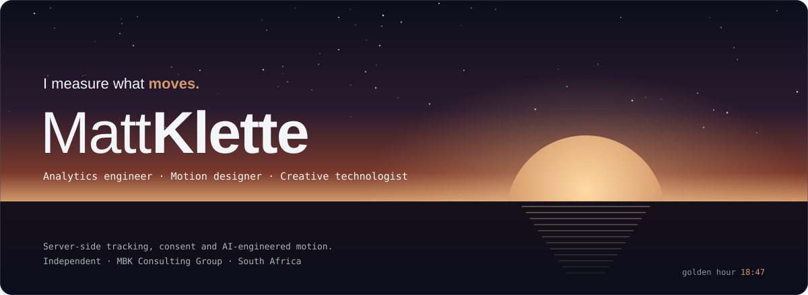
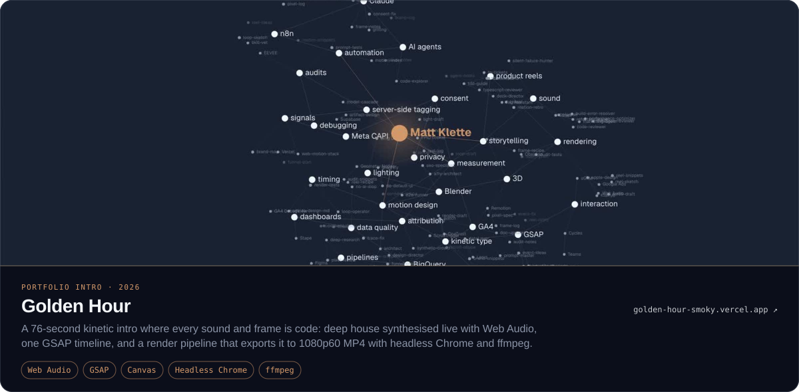
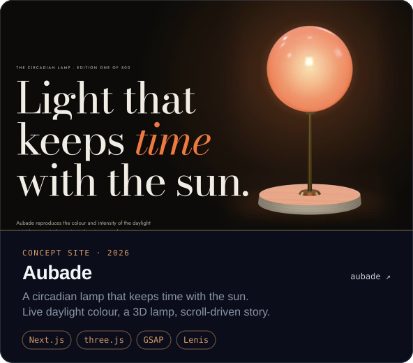
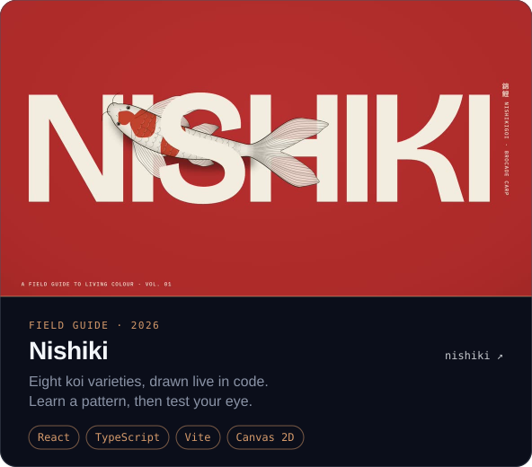
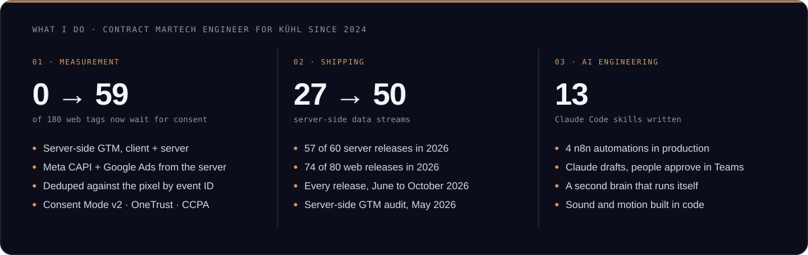

<b>Golden Hour</b> <a href="https://golden-hour-smoky.vercel.app">live</a> · <a href="https://github.com/Matthew-Klette/golden-hour">code</a>
&nbsp;&nbsp;|&nbsp;&nbsp;
<b>Aubade</b> <a href="https://aubade-eta.vercel.app">live</a> · <a href="https://github.com/Matthew-Klette/aubade">code</a>
&nbsp;&nbsp;|&nbsp;&nbsp;
<b>Nishiki</b> <a href="https://nishiki.vercel.app">live</a> · <a href="https://github.com/Matthew-Klette/nishiki">code</a>

<a href="https://www.linkedin.com/in/matthewklette">LinkedIn</a> ·
<a href="https://golden-hour-smoky.vercel.app">Portfolio intro</a> ·
<a href="https://www.linkedin.com/feed/update/urn:li:activity:7514394222310055936/">Watch the reel</a>

